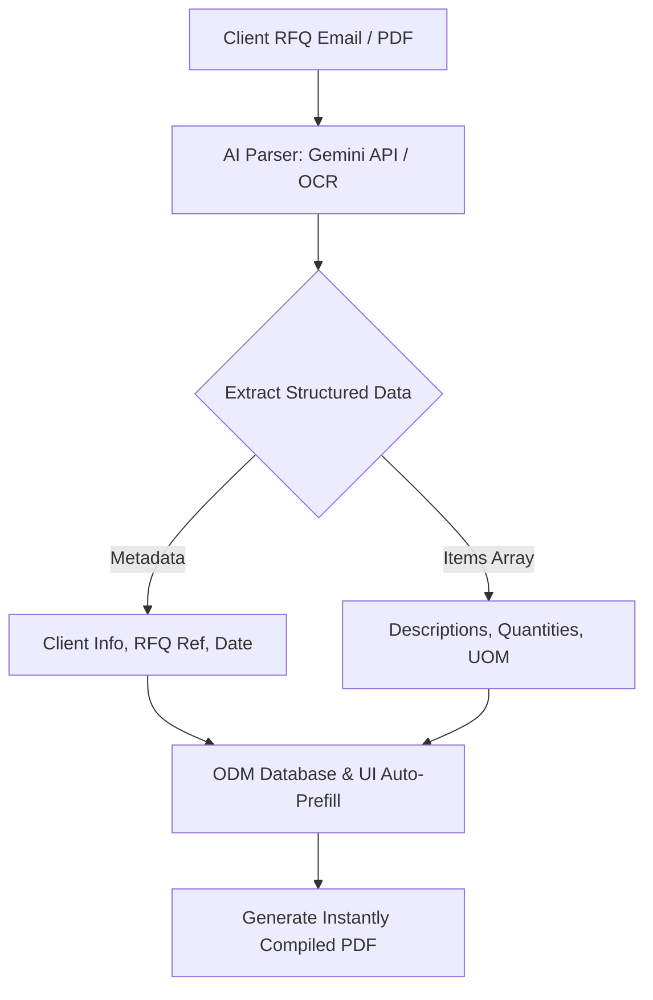

# 📖 ODM Quoting System - Master Developer Documentation
## Complete Architecture Deep Dive, Code Mechanics, & AI Automation Roadmap

Welcome to the official developer documentation for the **ODM Quoting System**. This comprehensive guide acts as a master reference manual for understanding the modular system architecture, individual code file functions, standard Tkinter UI programming patterns, and a forward-looking roadmap to automate your business workflow with cutting-edge Artificial Intelligence.

---

## 📂 1. Modular Architecture & Search Paths

The system utilizes an advanced, clean, and isolated directory structure that decouples raw logic from assets and data databases.

### Key File Mapping
- **`src/config.py`**: The central configuration orchestrator. It automatically identifies the execution base path (resolving package imports between standard terminal execution and PyInstaller packages) and injects all subfolders (`src/components/`, `src/features/`, `src/themes/`, etc.) directly into Python’s search path (`sys.path`). It also handles centralized database path resolution (`db/` folder isolation) to avoid directory conflicts.
- **`src/quotation.py`**: The parent core engine. It defines `QuotationApp`, which manages the main graphical window, item tables, auto-save loops, licensing keys, profile management, and global styling.
- **`src/invoice.py`**: The **Sales Tax Invoice** child class (`InvoiceApp`). Inherits from `QuotationApp` but implements customized variables, default pre-filled details (PRA, NTN, STN), ReportLab PDF generators, and the **5.5% Withholding Tax** calculation on GST-inclusive totals.
- **`src/commercial.py`**: The **Commercial Invoice** child class (`CommercialApp`). Houses specific commercial tax logic and printable sections matching custom commercial standards.
- **`src/delivery_challan.py`**: The **Delivery Challan** child class (`DeliveryChallanApp`). Focuses on physical dispatch, cargo tracking, bilty details, CNIC verification, and public/special vehicle logging.
- **`src/themes/theme_manager.py`**: The presentation manager. Dynamically loads and applies cohesive UI themes (`ttkbootstrap` library integration) while keeping state preferences linked to the SQLite database.

---

## 🛠 2. Tkinter Developer Mechanics: Variables & Lifecycle

To master or extend this software, you must understand how Python's built-in `tkinter` manages UI state variables, layouts, and window lifecycles.

### A. How to Define and Initialize a Class
In Tkinter, an application or page is represented by a Class. The constructor (`__init__`) accepts a parent window (`root` or `master`) and configures it:
```python
class MyCustomModule:
    def __init__(self, root, original_root=None):
        self.root = root               # The visual Toplevel or Tk window
        self.original_root = original_root # Link to the parent dashboard for navigation back
        self.root.title("My System Screen")
        self.root.geometry("800x600")
        
        # Call builders
        self._init_variables()
        self._build_layout()
```

### B. Defining Tkinter State Variables
Standard Python variables (`x = 5`) do **not** trigger UI updates automatically. Tkinter provides specialized **wrapper variables** that automatically sync with UI components (inputs, labels, checkboxes):
- `tk.StringVar(value="Default text")`: Handles string values.
- `tk.DoubleVar(value=0.0)`: Handles decimal/floating-point values.
- `tk.BooleanVar(value=True)`: Handles `True`/`False` states (great for checkboxes).

#### Declaring Variables:
```python
self.client_name_var = tk.StringVar(value="Orient Marketing")
self.wht_rate_var = tk.DoubleVar(value=5.5)
self.print_wht_var = tk.BooleanVar(value=True)
```

#### Writing to Variables (`.set()`):
To modify a variable's value dynamically, you **must** use the `.set()` method. Direct assignment will overwrite the object:
```python
# Correct
self.client_name_var.set("New Client Name")
self.wht_rate_var.set(8.5)

# Incorrect (breaks Tkinter linking!)
# self.client_name_var = "New Client Name"
```

#### Reading from Variables (`.get()`):
To retrieve the current user input or state from a variable, invoke `.get()`:
```python
current_client = self.client_name_var.get() # Returns a string
wht_percent = self.wht_rate_var.get()       # Returns a float
should_print = self.print_wht_var.get()     # Returns a boolean
```

### C. Binding Variables to UI Elements (Widgets)
Link the Tkinter variable directly to standard widgets via their `textvariable` or `variable` parameters:
```python
# 1. Binding StringVar to a Text Entry Field
entry = tk.Entry(self.root, textvariable=self.client_name_var)
entry.pack()

# 2. Binding BooleanVar to a Check Button Toggle
checkbox = tk.Checkbutton(self.root, text="Print Tax Summary", variable=self.print_wht_var)
checkbox.pack()
```

### D. Window Navigation and State Restoration
To switch screens without polluting memory or cluttering the desktop:
1. **`root.withdraw()`**: Completely hides the window from view (and the taskbar).
2. **`root.deiconify()`**: Restores the window's visibility instantly.
3. **`root.state('zoomed')`**: Maximizes the window to full screen. (Always chain this immediately after `deiconify()` to prevent the window from shrinking due to Windows OS DPI reset behavior!)

---

## 🔍 3. Deep Dive into File Architectures & Functions

### 📜 A. `src/quotation.py`
The foundational backbone of the application.
- **`init_database(self)`**: Connects securely to SQLite databases. Creates schemas for user logins, profiles, security questions, and quotation tracking.
- **`perform_login(self, user_data)`**: Destroys the login panel, restores the main `root` window in `state('zoomed')`, and spawns the `DashboardPanel`.
- **`auto_save_loop(self)`**: An asynchronous loop executing every 5 seconds. If `self.is_saved` is `False`, it calls `self.save_to_database()` in a silent background thread to prevent GUI lag.
- **`on_closing(self)`**: Intercepts the `"WM_DELETE_WINDOW"` close protocol (the **"X"** button). If `self.current_dashboard` is `None` (user is editing a quote), it redirects them to the Dashboard instead of exiting.
- **`go_to_dashboard(self)`**: Safely shuts down timers, runs an auto-save, cleans all UI children widgets from `self.root`, and restores the `DashboardPanel`.

### 📄 B. `src/invoice.py`
Manages formal taxation calculations and compliant printing.
- **`InvoiceApp` Class**: Inherits everything from `QuotationApp`. Overrides base setups to prefill tax fields (`self.stn_var`, `self.ntn_var`, `self.pra_var`) to Orient Marketing's values.
- **`recalc_all(self)`**: Combines the subtotal with an **18% standard GST** rate to obtain the GST-inclusive amount. It then dynamically calculates the **5.5% Withholding Tax** on that GST-inclusive total:
  $$\text{WHT Amount} = (\text{Sub Total} + \text{Total GST}) \times \frac{5.5}{100}$$
- **`_generate_pdf(self)`**: Builds a professional print layout using ReportLab. Generates tables, headers, and conditionally prints the Withholding Tax row in the PDF based on `self.print_wht_var.get()`.

### 🧾 C. `src/commercial.py`
Operates commercial invoice layouts.
- **`CommercialApp` Class**: Inherits from `QuotationApp`. Implements double-descriptions and handles custom currency prefixes.
- **`save_excel(self)`**: Uses `openpyxl` to build an Excel grid mirroring your invoice layouts, dynamically styling cell fills, thick borders, and formatting numbers as currency.

### 🚚 D. `src/delivery_challan.py`
Oversees transit logs.
- **`DeliveryChallanApp` Class**: Structured for cargo logs. Disables pricing tables completely to keep document focus strictly on packaging and logistics.
- **`source_special_var` / `source_public_var`**: Radio toggles which dynamically show/hide the cargo booking form (Vehicle CNICs, Bilty Number, booking date) in the UI.

---

## 🤖 4. AI Integration & Automation Roadmap

Integrating AI into your quoting software is the ultimate way to eliminate manual typing and automate document creation. Here is how to achieve it.

### A. Core Automation Ideas
1. **Email-to-Quote Automation**: Automatically scan incoming client emails (RFQ) and generate a draft quote inside your system containing the parsed client name, address, valid dates, and required item tables.
2. **AI-Powered Description Matcher**: When a user types a rough item description (e.g., *"15hp water pump motor"*), the AI scans your historical database and automatically pre-fills the correct item code, UOM, and standard unit price.
3. **Smart PDF Parser (OCR)**: Upload an incoming client RFQ in PDF format. The AI extracts the items, quantities, and specifications, instantly converting them into a ready-to-print Sales Tax or Commercial Invoice.



### B. Suggested AI Integrations
1. **Google Gemini API (Highly Recommended)**: Perfect for parsing text, matching descriptions, and understanding unstructured emails. You can send a prompt with an email body and receive structured JSON back.
2. **EasyOCR / Tesseract OCR**: To scan image-based purchase orders or printed tables and convert them into clean Python lists/dictionaries.
3. **LangChain**: For building intelligent agents that can query your historical SQL databases (e.g. *"Show me the total revenue generated from Orient Marketing last quarter"*).

---

## 🚀 5. Learning Path to Total Quoting Automation

To successfully build and deploy these AI integrations, here is a structured roadmap of technologies to learn.

### Phase 1: Python Advanced Automation & APIs (1-2 Weeks)
- **What to Learn**:
  - `requests` and Python API communication.
  - JSON data manipulation.
  - The **Gemini API** using the `google-generativeai` official SDK.
- **Goal**: Write a simple script that takes a raw, unstructured client email, sends it to Gemini, and extracts a structured JSON object containing:
  ```json
  {"client": "Orient Marketing", "items": [{"desc": "Water Pump", "qty": 2}]}
  ```

### Phase 2: Natural Language Processing (NLP) & Transformers (3-4 Weeks)
- **What to Learn**:
  - The Hugging Face `transformers` library.
  - Text Embeddings (converting words into numeric vectors).
  - Vector Databases (like `FAISS` or `ChromaDB`) for super-fast similarity searches.
- **Goal**: Create a product-matching engine. Convert all your historical item descriptions into embeddings. When a user types a new description, use cosine similarity to automatically match it with the closest historical description in less than 50 milliseconds!

### Phase 3: OCR & Document Intelligence (2 Weeks)
- **What to Learn**:
  - Document layout analysis.
  - Table extraction libraries (like `pdfplumber` or `Camelot`).
  - Image preprocessing using `opencv-python`.
- **Goal**: Process PDF Purchase Orders from customers and extract itemized tabular rows directly into Python dictionary arrays.

### Phase 4: Full App AI Orchestration (3 Weeks)
- **What to Learn**:
  - **LangChain** or **LlamaIndex** framework.
  - SQL Database Agents (Text-to-SQL execution).
- **Goal**: Add an AI Sidebar directly inside your ODM Quoting Dashboard. You can type: *"Create a new Sales Tax Invoice for client Orient Marketing based on their latest RFQ email"* and the system will automatically parse the email, calculate tax, apply the 5.5% withholding tax, and load it into your editor UI dynamically!

---
*© 2026 ODM Online Systems. Prepared for Muhammad Moawiz Sipra.*
